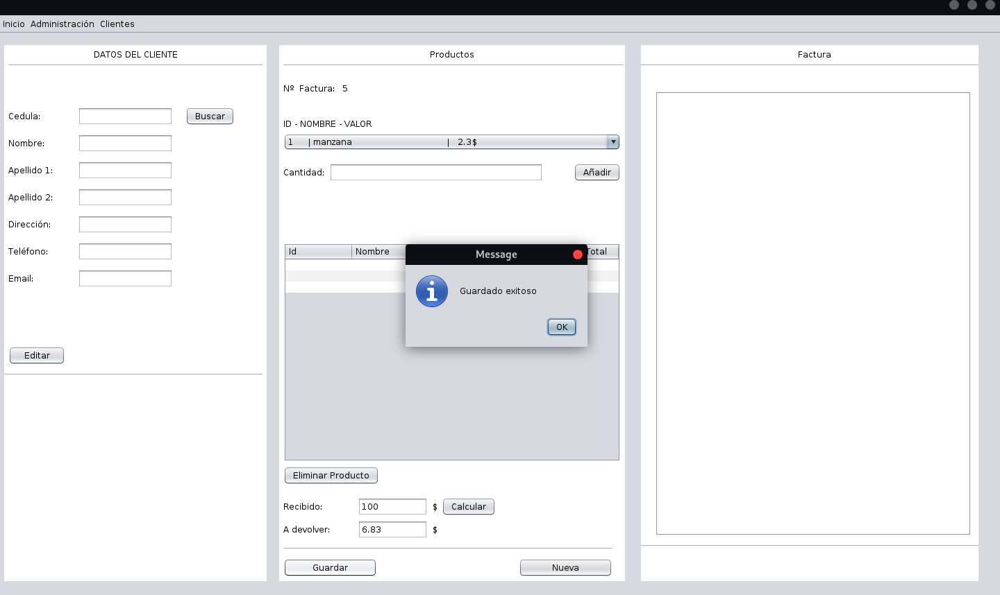

# bill software

This project is a simple bill software developed with POO with Java and Maven for  SQLite dependences.

IDE used: NetBeans.

Database: Is a relational data base used with SQLite, it has 4 tables to save all necessary data.

*(**note:** All data used is fake generated in <https://www.mockaroo.com/>)*

have 2 modules :

- For Admin:
  - Managment of clients , products and invoices.
- For Cashier:
  - Create new invoices and can add or edit clients's information.

#### SCRENSHOOTS
*(**note:** all the code is in english but the interface is in spanish)*

**Starting window**

**Cashier module**

**Admin module**

*Clients managment*

*Invoice managment*

*Products managment*

